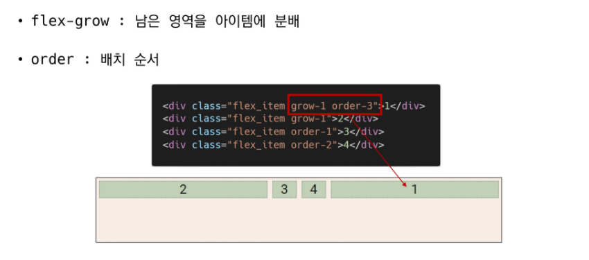

## 0204 라이브

# CSS Layout

- ### float

  - css 원칙 
    - Block - div // Inline - span
    - 모든 요소는 박스모델이고 위에서부터 아래로, 왼쪽에서 오른쪽으로 쌓인다.
  - 박스를 왼쪽 혹은 오른쪽으로 이동시켜 텍스트를 포함 인라인 요소들이 주변을 wrapping 하도록 함
  - 요소가 Normal flow를 벗어나도록 함
  - 속성
    - none : 기본값
    - left : 요소를 왼쪽으로 띄움
    - right : 요소를 오른쪽으로 띄움
    - 


- 

  - Clearing Float

    - Float는 Normal Flow에서 벗어나 떠 있는 상태

    - 따라서, 이후 요소에 대하여 Float 속성이 적용되지 않도록 Clearing이 필수적임

      - ::after 선택한 요소의 맨 마지막 자식으로 가상 요소를 하나 생성
        - 보통 content 속성과 함께 짝지어 요소에 장식용 컨텐츠를 추가할 때 사용
      - clear 속성 부여

    - ```html
      .clearfix::after{
      	content: "";
      	display: block;
      	clear: both;
      }
      ```

  - Float 정리

    - Float은 레이아웃을 구성하기 위해 필수적으로 활용 되었으며 최근엔 Flexbox, Grid 등장과 함께 사용도가 낮아짐
    - 활용전략 - Normal Flow에서 벗어난 레이아웃 구성
      - 원하는 요소들을 Float로 지정하여 배치
      - 부모 요소에 반드시 Clearing Float를 하여 이후 요소부터 Normal Flow를 가지도록 지정

- ### flexbox

  - CSS Flexible Box Layout
    - 행과 열 형태로 아이템들을 배치하는 1차원 레이아웃 모델
    - 축
      - main axis(메인 축)
      - cross axis(교차 축)
    - 구성 요소
      - Flex Container(부모 요소)
      - Flex Item(자식 요소)
  - 
    - flex-direction : row 하면 가로축이 main axis
    - flex-direction : column 하면  세로축이 main axis
  - Flexbox 구성 요소
    - Flex Container(부모 요소)
      - flexbox 레이아웃을 형성하는 가장 기본적인 모델
      - Flex Item들이 놓여있는 영역
      - display 속성을 flex 혹은 inline-flex로 지정
    - Flex Item(자식 요소)
      - 컨테이너에 속해있는 컨텐츠(박스)
  - 장점
    - 수동값 부여 없이
    - 1. 수직 정렬
      2. 아이템의 너비와 높이 혹은 간격을 동일하게 배치
  - 배치 설정
    - flex-direction
      - Main axis 기준 방향 설정
      - 역방향의 경우 HTML 태그 선언 순서와 시각적으로 다르니 유의


- 
  - 
    - flex-wrap
      - 아이템이 컨테이너를 벗어나는 경우 해당 영역 내에 배치되도록 설정
      - 즉, 기본적으로 컨테이너 영역을 벗어나지 않도록 함


- 
  -  flex-direction & flex-wrap
    - flex-direction : Main axis의 방향을 설정
    - flew-wrap : 요소들이 강제로 한 줄에 배치 되게 할 것인지 여부 설정
      - nowrap (기본 값) : 한 줄에 배치
      - wrap : 넘치면 그 다음 줄로 배치
    - flew-flow
      - flex-direction과 flex-wrap의 shorthand
      - flex-direction과 flex-wrap에 대한 설정 값을 차례로 작성
      - 예시 ) flew-flow: row nowrap;
  - 배치설정
    - justify-content
      - Main axis를 기준으로 공간 배분


- ​	
  -  
    - align-content
      - Cross axis를 기준으로 공간 배분 (아이템이 한 줄로 배치되는 경우 확인할 수 없음)


- 
  -  
    -  juistify-content & align-content
      - 공간배분
      - flex-start(기본 값) : 아이템들을 axis 시작점으로
      - flex-end : 아이템들을 axis 끝 쪽으로
      - center : 아이템들을 axis 중앙으로
      - space-between : 아이템 사이의 간격을 균일하게 분배
      - space-around : 아이템을 둘러싼 영역을 균일하게 분배(가질 수 있는 영역을 반으로 나눠서 양쪽에)
      - space-evenly : 전체 영역에서 아이템 간 간격을 균일하게 분배
    - align-items
      - 모든 아이템을 Cross axis 기준으로 정렬


- 
  -  
    -  align-self
      - 개별 아이템을 Cross axis 기준으로 정렬
      - 주의! 해당 속성은 컨테이너에 적용하는 것이 아니라 개별 아이템에 적용


- 
  -  
    -  align-items & align-self
      - Cross axis를 중심으로
      - stretch(기본 값) : 컨테이너를 가득 채움
      - flex-start : 위
      - flex-end : 아래
      - center : 가운데
      - baseline : 텍스트 baseline에 기준선을 맞춤
  - 기타 속성
    - flex-grow : 남은 영역을 아이템에 분배
    - order : 배치 순서



`flexboxfroggy`

- ### grid

# Bootstrap

- bootstrap
  - spacing
  - .mt-1?
  - 
  - 
  - .mx-0?
  - 
  - 
  - 
  - 


- ### bootstrap grid system

  - Grid system (web design)
    - 요소들의 디자인과 배치에 도움을 주는 시스템
    - 기본 요소
      - Column : 실제 컨텐츠를 포함하는 부분
      - Gutter : 칼럼과 칼럼 사이의 공간 (사이 간격)
      - Container : Coumn들을 담고있는 공간
  - Bootstrap grid Sytsem
    - flexbox로 제작됨
    - container, rows, column으로 컨텐츠를 배치하고 정렬
    - 반드시 기억해야할 2가지!
      - 12개의 column
      - 6개의 grid breakpoints

## Responsive web