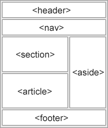

## BEM

### 개요

> " BEM은 웹 개발에 대한 컴포넌트 기반 접근 방식입니다.
> 
- 사용자 인터페이스를 독립적 블록으로 나누는 것을 기반으로 하며, 복잡한 UI를 구성 할 때, 인터페이스를 쉽고 빠르게 개발 할 수 있으며 복사 및 붙여 넣기 없이 기존 코드를 재 사용 하기 용이하도록 하고자 개발 되었습니다.

**주의**

**BEM 방법론은 ID에는 사용할 수 없고, 오직 클래스명에서만 활용할 수 있다.**


### Naming Convention

- **BEM** 역시 CSS의 Naming Convention 중 한 방법이지만, 여기서 말하고자 하는 것은 표준적인 CSS Naming Convention을 의미 한다.

- CSS 에서는 JS나 Python 등에서 일반적으로 사용하는 camelCase 나 PascalCase 를 사용하지 않는다. 명확하게는 CSS 속성 이름과 같은 형식을 사용한다.

```jsx
// JS 에서는 흔히 camelCase를 사용 하였다.
var redBox = document.getElementById('...')
```

```scss
/* not Good */
.listCard { font-weight: bold; } 

/* Good */
/* `-` 을 사용하며, 전부 소문자로 작성한다. */
.list-card { font-weight: bold; } 
```


## Block Element Modifiers

### **Block**

> "문단 전체에 적용된 요소 또는 요소를 담고 있는 컨테이너를 의미한다."
> 


**header, nav, article, footer 등이 각자의 영역을 가지고 있다면, 각 영역들을 블럭으로 간주한다.**

- 각 컨텐츠 영역들은 한 페이지 전체, 즉 우리가 생각하는 HTML semetic elements 에 해당하는 요소들이 될 수도 있을 것이고, 작게는 하나의 section 내에서 존재하는 각 요소를 담고 있는 컨테이너가 될 수도 있다.



```html
<!-- card container 자체가 하나의 블럭 -->
<div class="card" style="width: 18rem;">
	
	<!-- body, footer와 같이 각각의 블럭을 이루고 있다. -->
  <div class="card-body"></div>
	<div class="card-footer"></div>
</div>
```


**블럭** **요소는 클래스 명의 근간이 되므로 항상 맨 앞에 위치하도록 한다.**

- 블럭을 정의 했다면, 블럭이 형성한 클래스의 어근을 선두로 해당 블럭이 포함하는 요소들의 클래스 명을 지어 나가는 형식으로 구성한다.

```scss
.card-body__icon { ... }
.card-body__input { ... }
.card-items { ... }
```


**단, 블럭의 이름은 그 블럭의 목적으로 작성되여야 하며, 블럭의 상태를 나타내지 않는다.**

```html
<!-- Not Good -->
<div class="red-text"></div>

<!-- Good -->
<div class="card-title"></div>
```


**블럭은 서로 중첩될 수 있으며, 여러번 중첩 될 수 있다.**

```html
<!-- card block -->
<div class="card" style="width: 18rem;">
	
	<!-- 중첩된 card-body,footer block-->
  <div class="card-body">...</div>
  <div class="card-footer">...</div>
</div>
```


### **Element**

> "블럭이 포함하고 있는 한 조각을 의미한다. "
> 

**각 요소는 두개의 밑줄표시로 연결하여 블럭 다음에 위치 시킨다.**

```html
<!-- card-body block-->
<div class="card-body">
	<!-- card-body block 의 title element -->
	<div class="card-body__title">...</div>

	<!-- card-body block 의 thumb-nail element -->
	
</div>
```


**요소의 이름은 해당 요소의 목적을 위해 작성되어야 하며, 요소의 상태를 나타내지 않는다.**

```html
<!-- Not Good -->
<div class="red-text"></div>

<!-- Good -->
<div class="card-body__title"></div>
```

**요소역시 중첩될 수 있으며, 여러번 중첩 될 수 있다.**


**단, 요소는 항상 블럭의 일부입니다. 즉, 요소의 요소가 될 수 없다.**

```html
<!-- Not Good -->
<div class="card-body">
	<div class="card-body__info">
		<!-- 요소는 요소를 가질 수 없습니다. -->
		<span class="card-body__info__date">...</span>
	</div>
</div>

<!-- Good -->
<div class="card-body">
	<div class="card-body__info">
		<!-- card-body가 가지는 요소 중에 하나라는 의미로 사용 -->
		<div class="card-body__date">...</div>
		<!-- 혹은 -->
		<div class="card-body__info-date">...</div>
	</div>
</div>
```


**요소는 항상 블럭의 일부이므로 블럭과 별도로 사용해서는 안된다.**

```html
<!-- Not Good -->
<div class="card-body"> ... </div>
...
<!-- card-body__info element가 card-body block을 벗어남 -->
<div class="card-body__info">...</div>

<!-- card-body block 을 벗어났으며, card-body__info 와 별개로 사용됨 -->
<div class="card-body__info-date">...</div>
```


**요소는 블럭 컴포넌트의 선택사항이다. 모든 블럭이 반드시 요소를 가지지 않는다.**

```html
<!-- card-body block -->
<div class="card-body">
	<!-- like-button block -->
	<button class="like-button">🤍</button>
</div>
```

---

💡 **왜 block이나 element 형태로 만들어야 하나요?**

**Create Block**
⇒ 동일한 블럭이 재사용 될 수 있을 때 블럭을 생성합니다. 
예를들어, card component 의 경우, 하나의 태그로 둘러쌓여 있으면서 여러번 재사용 되어야 하는 component 이기에 card 블럭을 생성하여 관리할 때 코드의 재사용 성을 높일 수 있습니다.
단, 각 블럭은 다른 구성 요소에 의존하지 않고 독자적으로 존재 할 때 생성 할 수 있습니다.

**Create Element**
⇒ 생성하고자 하는 요소가 부모(block) 없이 별도의 섹션을 가질 수 없거나, 특정 블럭 내에서만 특별히 존재할 때 사용 할 수 있습니다. 
특히 동일한 역할을 수행하는 요소들이 존재 할 때, 무엇(어떤 블럭에 속한 요소인지)을 위한 요소인지 파악하기 쉽게 도와줍니다. 

단, 개발을 단순화 하기 위해 하나의 요소로 분리되어야 하는 요소는 예외입니다. 예를 들어, card-body block의 like-button 은 card-body의 element 이지만, 다른 곳에서 재사용 될 가능성이 높으며 동시에 하나의 섹션으로 분류할 수 있기 때문에 블럭으로 간주합니다.

---


### **Modifier**

> "블럭 또는 요소의 속성을 의미한다."
> 
- 블럭 또는 요소의 외관이나 상태가 변화된 형태를 나타낼 때 사용 할 수 있다. 클래스명을 짓는 목적은 해당 요소를 반복하여 사용하기 위한 것이므로 스타일이 같다면, 새로운 클래스를 정의할 필요가 없다. 하지만, 특정 요소의 스타일을 수정하고자 한다면 modifier를 활용한다.

**수정자는 하이픈 2개('—')로 작성하며, 각 이름은 자신의 외양이나 상태, 행동을 작성한다.**

수정자의 경우 하나의 언더스코어 ('_') 로 구분 짓는 경우도 있으나, element와의 차이가 명확하지 않아 개인적으로 하이픈 2개를 선호하는 편입니다. 어떠한 방법이 정답이다는 것은 아닙니다.

```html
<!-- small size like button -->
<div class="like-button--sm"> ... </div>

<!-- navigation disabled menu -->
<div class="nav-link--disabled"> ... </div>

<!-- theme color change -->
<div class="card-body--secondary"> ... </div>
```

---

💡 **클래스 명이 너무 길어지는 것 아닌가요?**
클래스를 만들 때 가장 중요시 여겨야 할 부분은 클래스명이 무엇을 나타내는지 분명하게 전달할 수 있느냐 입니다. 또한, 각각의 명명법은 어디까지나 개인의 취향이고, 개발 수준에 있어 빠르고 명확한 표기를 우선적으로 하되, 이 부분에 대해 너무 고민하지 않도록 하는 것도 중요합니다.
DRY(don't repeat yourself) 는 CSS 및 HTML에도 유지되어야 하므로 더 나은 의미론적인 방식을 찾았을 때 클래스명을 업데이트 시키는데 문제가 없는 수준만 유지 하면 될 것입니다.


---


## 참조 사이트

[BEM - Block Element Modifier](http://getbem.com/naming/)

[BEM(Block Element Modifier) 방법론](https://webclub.tistory.com/263)

[Methodology](https://en.bem.info/methodology/quick-start/#block)

[CSS Naming Conventions that Will Save You Hours of Debugging](https://www.freecodecamp.org/news/css-naming-conventions-that-will-save-you-hours-of-debugging-35cea737d849/)